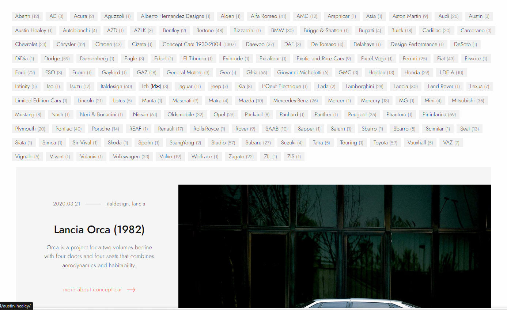
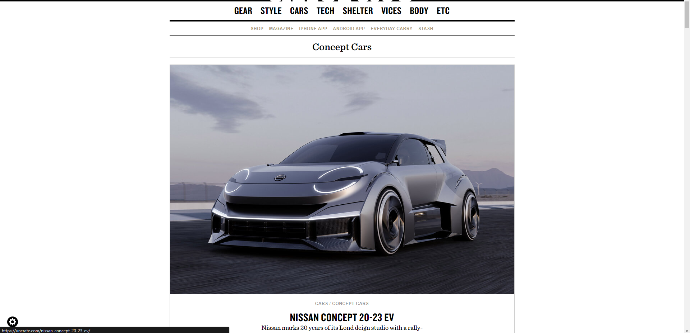
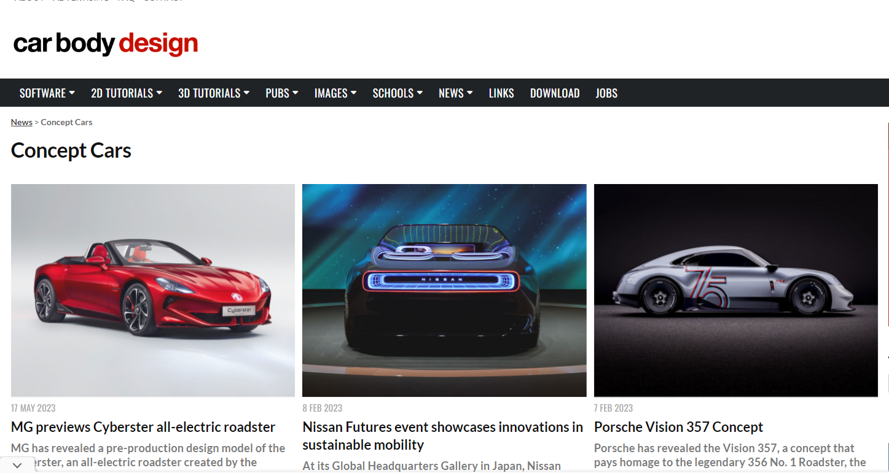
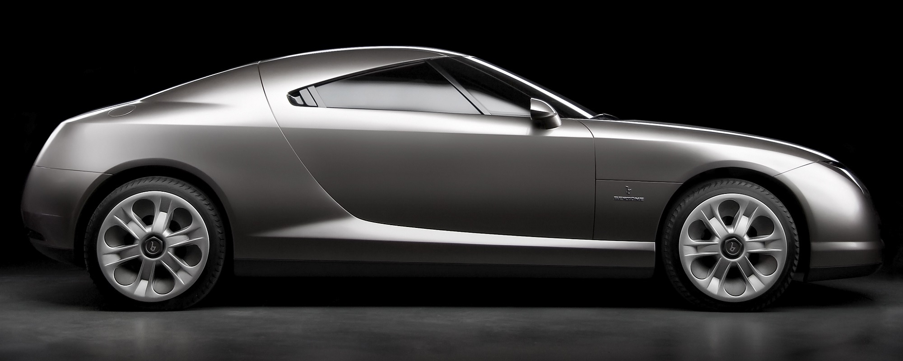
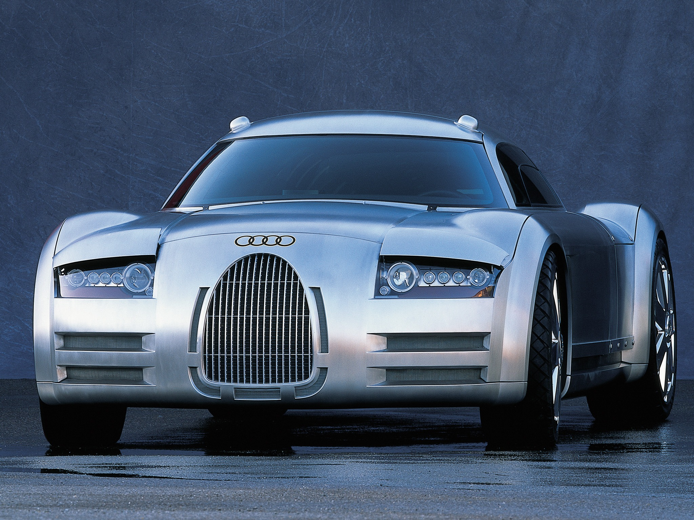
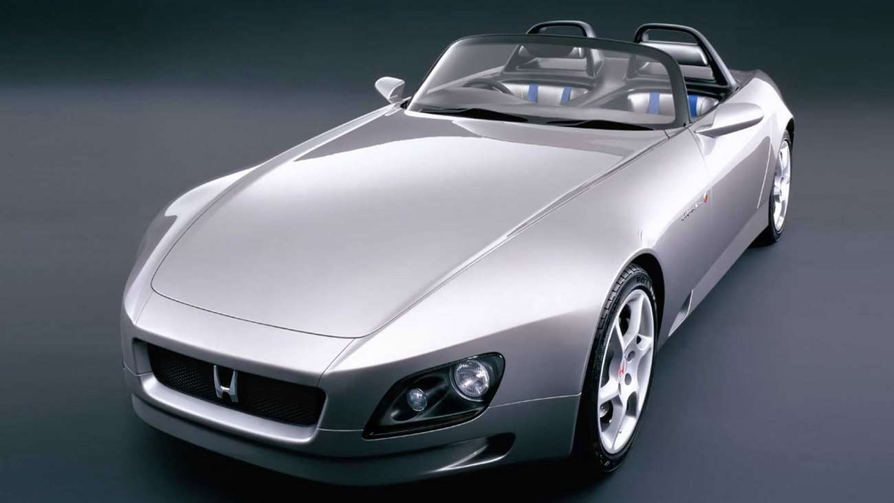
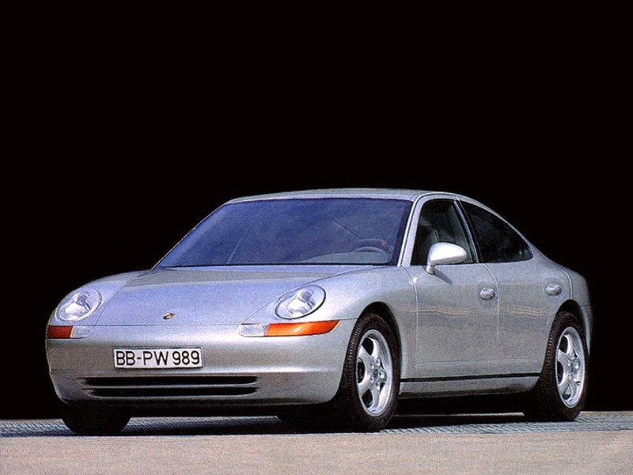

## Nome

Concept Drives

## Objetivos

Arquivo de conceitos de carros variados com várias marcas, com filtragem variadas das cenas de carros

## Audiencia

- Pessoas, normalmente do sexo masculino, dos 16 aos 90 anos
- Querem conhecer mais acerca de carros conceito não conhecidos até então

## Referencias

[https://oldconceptcars.com](https://oldconceptcars.com)

Pagina principal com filtros por decadas e search bar

Abaixo com filtros por marca

Destaques

Parte de baixo com redes sociais, procura por tags etc

[https://uncrate.com/cars/concept-cars/](https://uncrate.com/cars/concept-cars/)

Página com um destaque com uma linha completa, seguida de uma grid 2 * nºlinhas variável

[https://www.carbodydesign.com/news/concept-cars/](https://www.carbodydesign.com/news/concept-cars/)

Página de notícias acerca de páginas de conceitos, organizados em grelha

Website de noticias variado, com filtro por marca

[https://www.apple.com/br/shop/ipad/accessories](https://www.apple.com/br/shop/ipad/accessories)

Design Interessante, grelha de diferentes formatos com diferentes produtos

Cores neutras

## Lista de páginas

- Página inicial com titulo e imagens de diferentes conceitos em diferentes tamanhos~
- Vista em Lista com possibilidade de filtragem, etc
- Páginas com detalhes de cada conceito

## Cars

### Wolkswagen EA 266

The Predecessor concept of the iconic Golf Mk1

### Alfa Romeo Bella

Bertone Designs

Audi Resemeyer

The Predecessor of Bugatti Veyron

### Honda SSM

Predecessor of Honda S2000

### Porsche Panamera (989)

Concept of the first 5 door salon from Porsche, Directors wanted to create a car that had the same confort, space and security of a BMW 7 series, a Mercedes S class or an Audi A8 with the sportiness that marks the Porsche Brand

### Peugeot Peugette

